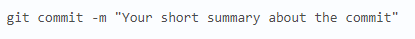

## Внесение изменений однострочным сообщением или через редактор

При создании коммита в репозитории можно добавить однострочное сообщение с помощью параметра **commit с флагом -m**. Само сообщение вводится непосредственно после флага, в кавычках.

Также можно открыть текстовый редактор в терминале для написания полного сообщения коммита. Оно может состоять из нескольких строк текста, в котором подробно характеризуются изменения, внесённые в репозиторий.

### [<Содержание>](readme.md)